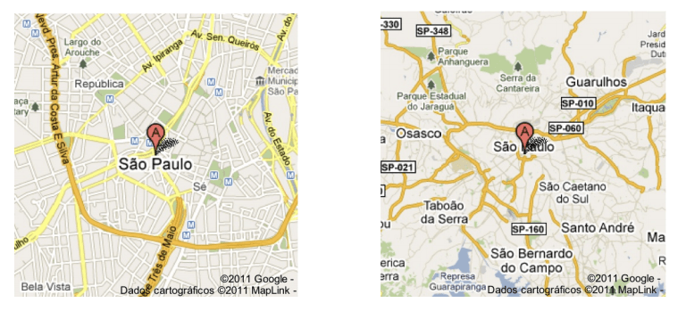

# Reduzindo Detalhes em um Mapa
Leonardo Nascimento é um garoto de 13 anos apaixonado por cartografia. Durante as férias de janeiro de 2011, ele alternava seu tempo entre navegar na internet (pesquisando sobre mapas) e arrumar sua coleção de mapas. Navegando na internet, Leonardo descobriu um site especializado em mapas, o Google Maps. Depois de alguns dias usando o site, Leonardo percebeu que quando diminuía o zoom algumas ruas não eram mais exibidas no mapa, isto é, o zoom determinava também o nível de detalhe do mapa. A figura abaixo ilustra um dos testes feito por Leonardo.



Ele sabe que você participa da OBI e que você adora resolver os problemas que envolvem mapas. Então resolveu formular o seguinte problema: dado um mapa de cidades e rodovias que as ligam, selecione um subconjunto das rodovias tal que entre qualquer par de cidades exista uma rota ligando-as e a soma dos comprimentos das rodovias é mínimo. Na figura abaixo e à esquerda temos um exemplo com cinco cidades e seis rodovias ligando-as. A figura abaixo e à direita ilustra uma solução cuja soma dos comprimentos é 34.


Para facilitar um pouco sua vida, Leonardo determinou que você só precisa dizer a soma dos comprimentos das rodovias do subconjunto selecionado para um dado mapa.

## Entrada
A primeira linha da entrada contém dois números N (1 ≤ N ≤ 500) e M (1 ≤ M ≤ 124750) que representam o número de cidades e o número de rodovias respectivamente. Cada uma das próximas M linhas é composta por três inteiros U, V (1 ≤ U, V ≤ N e U ≠ V) e C (1 ≤ C ≤ 500) que indiciam que existe uma rodovia de comprimento C que liga as cidades U e V.

## Saída
A saída consiste em apenas uma linha contendo a soma do comprimento das rodovias selecionadas.

### Exemplos
* Entrada 1
```
5 6
1 2 15
1 3 10
2 3 1
3 4 3
2 4 5
4 5 20
```
* Saída 1
```
34
```
* Entrada 2
```
4 6
1 2 1
1 3 10
1 4 1
2 3 1
2 4 10
3 4 1
```
* Saída 2
```
3
```
